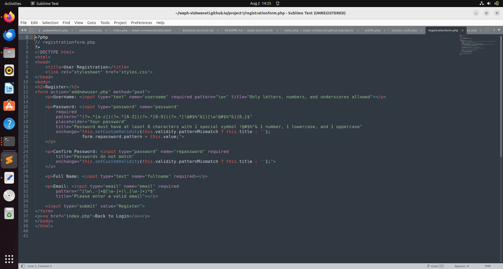

# WAPH – Project 2: Secure Full‑Stack Web Application Development

*Course:* Web Application Programming and Hacking (WAPH)
  
*Instructor:* Dr.Phu Phung
 
*Student:* Vishwa Teja Neti
  
*Email:* netiv1@udayton.edu  

  


## 1. Project Overview :

This project implements a secure PHP & MySQL full‑stack web application with:
-User registration
-Secure login
-Profile management
-Password update
-Session management
-CSRF protection for modification forms
-HTTPS deployment

Security measures include password hashing, HTTPS, input validation, prepared statements, and anti‑CSRF tokens. The application is hosted locally on Apache with a self‑signed SSL certificate.

*GitHub repository link:* [https://github.com/waph-vishwaneti/waph-vishwaneti](https://github.com/waph-vishwaneti/waph-vishwaneti)


## 2. Functional Requirements

## 2.1 User Registration :

-Implemented in `registrationform.php` (front‑end) and `addnewuser.php` (back‑end).
-Uses HTML5 & JavaScript validation for client‑side checks.
-Server‑side validation in PHP.
-Passwords are hashed with MD5 before storing in the MySQL database.
-SQL uses prepared statements to prevent SQL injection.

*Screenshot:*
  


## 2.2 Login :

-Implemented in `index.php`.
-Validates credentials using prepared statements and MD5 hash check.
-On success, starts a secure PHP session and stores a browser fingerprint.
-Redirects to `profile.php` upon success.

*Screenshot:*
  


## 2.3 Profile Management :
 
-`profile.php` displays user info.
-`editprofileform.php` allows updating `fullname` and `email`.
-`editprofile.php` updates the DB using prepared statements.
-Includes CSRF token in form.

*Screenshot:*
  


## 2.4 Password Update :
 
-Implemented in `changepasswordform.php` and `changepassword.php`.
-Requires current password verification.
-Enforces strong password pattern.
-Uses CSRF token.

*Screenshot:*
  


## 3. Security & Non‑Technical Requirements

## 3.1 Security : 

-HTTPS enforced (`default-ssl.conf` updated for self‑signed cert).
-Password hashing with MD5.
-No root MySQL account used — custom user `waphuser` with limited privileges.
-All SQL queries use prepared statements.

## 3.2 Input Validation :
 
-Client‑side: HTML5 required fields, `pattern` attributes.
-Server‑side: `trim()`, `htmlspecialchars()`, and regex checks.
-Prevents XSS and SQL injection.

## 3.3 Database Design :
 
-MySQL DB `waphProject` with `users` table.
```sql
CREATE TABLE users (
    username VARCHAR(50) PRIMARY KEY,
    password CHAR(32) NOT NULL,
    fullname VARCHAR(100),
    email VARCHAR(100)
);


##3.4 Front‑end Development :

-HTML5/CSS3 with optional external stylesheet.

-Simple, responsive forms.

##3.5 Session Management :

-Session bound to browser user‑agent to prevent hijacking.

-Secure session destruction on logout.

-Session fixation prevention with session_regenerate_id(true) on login.

##3.6 CSRF Protection :

-Token generated in session_auth.php:

if (empty($_SESSION['csrf_token'])) {
    $_SESSION['csrf_token'] = bin2hex(random_bytes(32));
}


-Token embedded in editprofileform.php and changepasswordform.php.

-Token validated in corresponding POST handlers.


##Demo Video :

-Video Demo Link :

[Watch the demo](https://github.com/waph-vishwaneti/waph-vishwaneti.github.io/blob/main/netiv1-project1-demoVideo.mp4)


##Appendix: (Code Snippets) :





##Conclusion :

Through this project, I gained practical experience in building a secure full‑stack web application from the ground up. I learned how to implement user authentication, profile management, and password updates while following security best practices such as input validation, prepared statements, session management, and CSRF protection.
Additionally, I configured HTTPS with a self‑signed certificate, created a secure MySQL database user, and reinforced my understanding of the importance of protecting user data. This assignment helped me connect theoretical security concepts from lectures to real‑world implementation, strengthening both my PHP/MySQL skills and my awareness of common web vulnerabilities.
